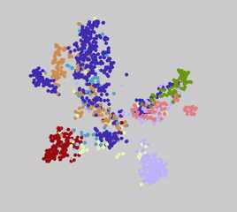
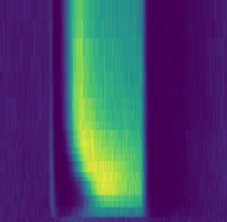

# A classification model for mouse retinal ganglion cells


## About
This supervised model, implemented in C++, was built to classify mouse retinal ganglion cells according to their physiological response properties. Full data, results, and further references are available in the [RGCTypes.org](http://rgctypes.org) online gallery.

### Stimulus and Recording
Under construction
*spots of light of various sizes and constant luminance centered on the cell's receptive field*
*responses are upsampled onto common reference frame using nearest-neighbors imputation and resulting features are penalized based on goodness-of-fit*
*additional fluff goes here*

### Model architecture
1. An error-correcting output code is used to reduce the multi-class problem into a series of binary ones. Model output takes the form of a posterior probability estimate for class membership given a uniform prior.
2. Each binary learner is composed of AdaBoosted decision trees.
3. Decision trees are trained using node-wise elastic net regression for feature reduction.
4. Hyperparameters are chosen by Bayesian Optimization using the bayesopt() function in MATLAB.

## Compilation
Compile using the provided makefile. If the CBLAS header file is not in the system include path, edit `$(CBLAS)` accordingly, or call make using `CBLAS=/path/to/cblas/`. Optionally compile using `make debug` to enable debugging.

## Dependencies:
- g++ (latest)
- [CBLAS](https://askubuntu.com/a/853516)
- parameter file (see below)
- data files (see below)

## Usage:
### Building a model from scratch
Not yet implemented

### Training
```
$ ./train PARAM_ID NUM_THREADS
```
will train an ensemble using the given parameter file for the next fold, creating a sub-directory named `PARAM_ID/` if it does not yet exist. Learners are trained in parallel using `NUM_THREADS` workers.

```
$ ./ecoc PARAM_ID
```
will append an ECOC coding matrix to the corresponding parameter file if one does not already exist; otherwise it will create a new coding matrix and delete the old records of training and normalization.

### Normalization
```
$ ./transform PARAM_ID
```
will train a calibration model corresponding to the next pair of folds. Outputs of the calibrated model take on a 

### Testing
```
$ ./test PARAM_ID TRAIN_FOLD TEST_FOLD TRANSFORM_FOLD
```
loads the trees from the training fold directory and attempts to classify the data in the test data file. `TRANSFORM_FOLD` is optional. The classification loss (class-wise; mean squared error for calibrated models, accuracy for uncalibrated models) is recorded in the parameters file.

### Printing
```
$ ./print PARAMS_ID FOLD_ID FOREST_ID TREE_ID
```
will print the structure of the corresponding tree to the command line.

## File Formats:
### Parameter Files (`{PARAM_ID}params.in`)
Each file contains an ASCII-formatted list of numbers detailing the training parameters:
- Elastic net parameters
  - Number of features
  - Number of cross-folds
  - Number of lambda values
  - Alpha value
- Tree parameters
  - Number of repeats per node
  - Maximum tree depth
  - Minimum leaf size
- Forest parameters
  - Maximum tree count
  - Minimum tree count
  - Number of trees to check stopping criterion over
  - Improvement threshold to stop training 
- Ensemble parameters
  - Number of forests
  - Probability of negative class membership
  - Probability of positive class membership
  - Number of unique training labels
- Coding scheme - a (labels-by-forests) matrix of identifiers on {-1, 0, 1}
- Training time (in seconds-times-threads)
- Transform status (1 indicating a completed transform)
- Classification result - a comma-separated list
  - Training fold
  - Testing fold
  - Transform fold (if applicable)
  - Loss (class-weighted; mean squared error for calibrated models, accuracy for uncalibrated models)

### Data Files (`fold{#}.in`)
A binary file containing the PSTH data sampled on a common grid in the following format:
- Number of cells (uint16)
- Number of time points (uint16)
- Number of spot sizes (uint16)
- Start time (double)
- End time (double)
- Time step (double)
- Smallest spot (uint16)
- Largest spot (uint16)
- Cell data:
  - Cell name string length (uint8)
  - Cell name (char array)
  - Cell type (char, starting with 1 up to 256)
  - Quality of time point (boolean)
  - Quality of spot size (uint32)
  - PSTH (double array)

### Tree Files (`{PARAM_ID}/fold{#}/forest{#}/tree{#}.out`)
A binary file containing the training results. Currently only implemented for verbose trees:

**Tree**
- Number of cells/samples (int)
- Parameters (object)
- Initial random generator state (object)
- Final random generator state (object)
- Sample weights (double array)
- Tree weight (double)
- Root node (object)

**Node**
- 1 (char, indicating status as node)
- Number of cells/samples (unsigned int)
- Number of nonzero weights (unsigned int)
- Time point values (double array)
- Spot size values (double array)
- Feature weights (double array)
- Feature means (double array)
- Feature scaling (double array)
- Time point quality (double array)
- Spot size quality (double array)
- Feature quality (double array)
- Model intercept (double)
- Selected lambda (double)
- Model deviance (double)
- Posterior class uncertainty (double)
- Model support (double)
- Left child node (object, recursive)
- Right child node (object, recursive)

**Leaf**
- 2 (char, indicating status as leaf)
- Number of positive samples (unsigned int)
- Number of negative samples (unsigned int)
- Score for samples reaching this leaf (double)
- Total weight that reached this leaf while training (double)

### Normalization Files (`{PARAM_ID}/fold{#}/forest{#}/fold{#}.LUT`)
A binary file containing the mapping from the forest output onto [0,1], representing the probability of positive class membership
- Number of samples used to create mapping (unsigned short int)
- AdaBoost scores (double array)
- Probability (double array)

## References
1. [Joint 3-D vessel segmentation and centerline extraction using oblique Hough forests with steerable filters](https://pubmed.ncbi.nlm.nih.gov/25461339/)
2. [Regularization Paths for Generalized Linear Models via Coordinate Descent](https://pubmed.ncbi.nlm.nih.gov/20808728/)
3. [Obtaining calibrated probability estimates from decision trees and naive Bayesian classifiers](https://scholar.google.com/scholar?q=Zadrozny%2C%20B.%2C%20Elkan%2C%20C.%3A%20Obtaining%20calibrated%20probability%20estimates%20from%20decision%20trees%20and%20naive%20bayesian%20classifiers.%20In%3A%20ICML%20proceedings%2C%20pp.%20609%E2%80%93616%20%282000%29)
4. [Transforming classifier scores into accurate multiclass probability estimates](https://scholar.google.com/scholar?q=Transforming+classifier+scores+into+accurate+multiclass+probability+estimates+B+Zadrozny,+C+Elkan&hl=en&as_sdt=0&as_vis=1&oi=scholart)
5. [Reducing multiclass to binary by coupling probability estimates](https://scholar.google.com/scholar?hl=en&as_sdt=0%2C14&q=B.+Zadrozny.+Reducing+multiclass+to+binary+by+coupling+probability+estimates&btnG=)
6. [Multi-class adaboost](https://scholar.google.com/scholar?hl=en&as_sdt=0%2C14&as_vis=1&q=Multi-class+adaboost+T+Hastie%2C+S+Rosset%2C+J+Zhu%2C+H+Zou+&btnG=)